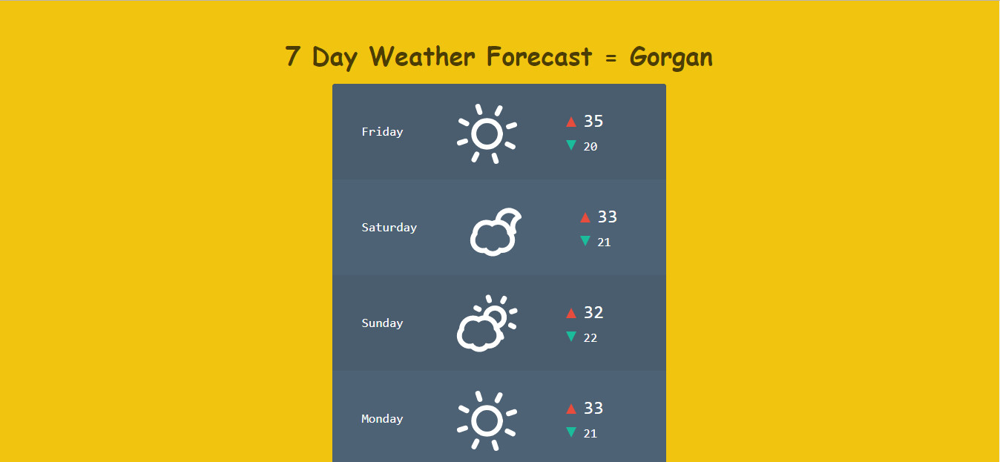

# Weather Forecast
weather forecast webpage with node.js


# Installation

```bash
1- git clone https://faridvatani@bitbucket.org/faridvatani/weather-forecast.git
2- cd weatherforecast
3- npm install
4- node server.js
```
